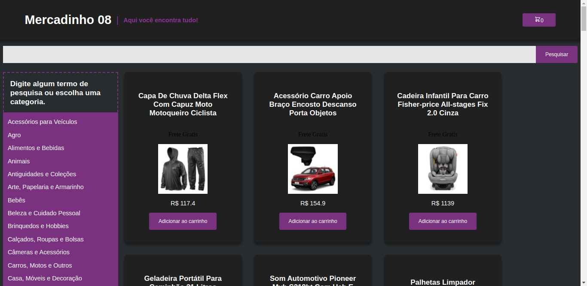
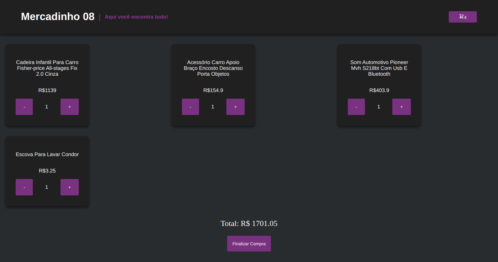

# Front End Online Store !

The idea of this project is that as a group, we should create a front end for an online store, with cart functionality, finalize payment, product details, and be able to search for a specific product.

 

## Home

 

## Cart

# Technologies Used

For this project the following technologies were used:

- [JavaScript](https://developer.mozilla.org/pt-BR/docs/Web/JavaScript)
- [ReactJS](https://pt-br.reactjs.org/)
- [Docker](https://www.docker.com/)

## How to Use:

1. Clone the repository

  ~~~bash
  git clone git@github.com:JeffThierch/Tryunfo.git
  ~~~

2. In the root of the project change the .env_example file to .env

3. (Optional) - Change the environment variables.

4. In the root of project run the commands:

  ~~~bash
  docker-compose up --build
  ~~~

5. If everything is configured correctly, after the build process you can simply access the application.
